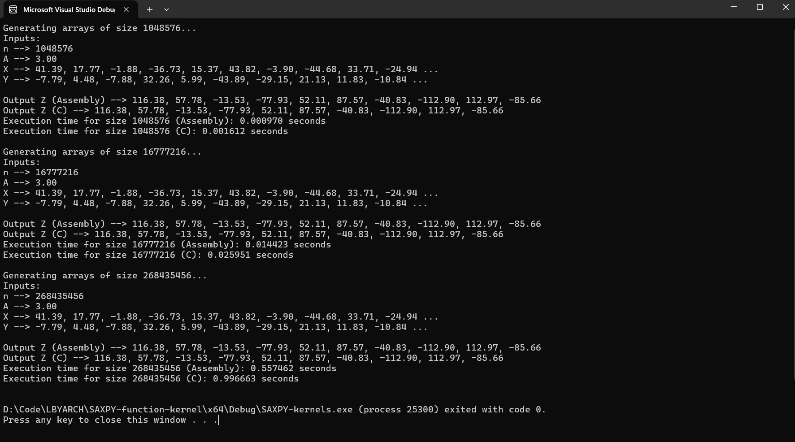
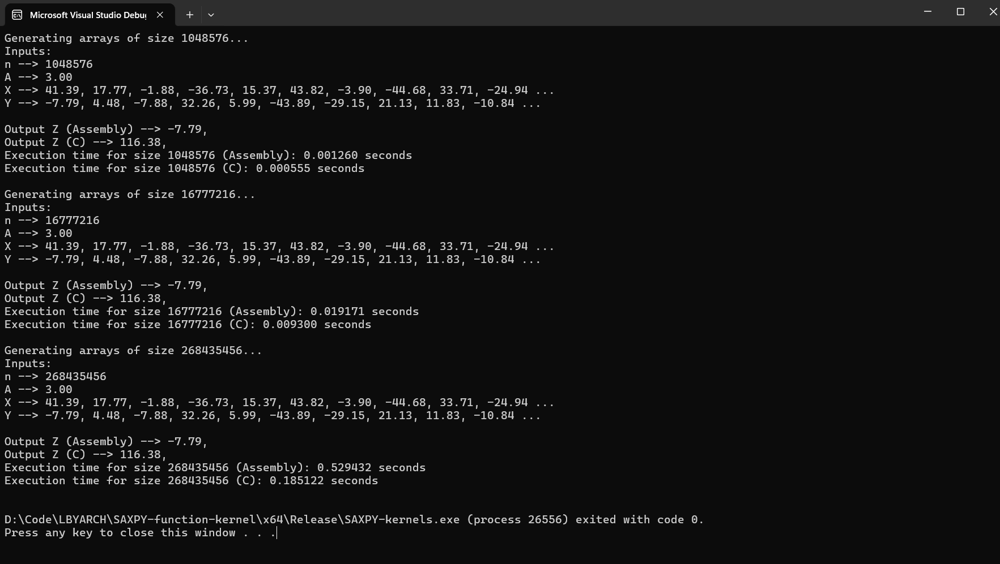

# SAXPY Function in C and x86-64 assembly language
Kernels written in C and x86-64 assembly language that performs the SAXPY (A*X + Y) function.

## Execution Times and Analysis

### Debug Mode
| Kernel          | Vector Size (n) | Average Execution Time (seconds) |
|-----------------|-----------------|----------------------------------|
| C               | 2^20            |                         0.001594 |
| C               | 2^24            |                         0.027349 |
| C               | 2^30            |                         0.445521 |
| x86-64 Assembly | 2^20            |                         0.000822 |
| x86-64 Assembly | 2^24            |                         0.015923 |
| x86-64 Assembly | 2^30            |                         0.294265 |
### Release Mode
| Kernel          | Vector Size (n) | Average Execution Time (seconds) |
|-----------------|-----------------|----------------------------------|
| C               | 2^20            |                         0.001191 |
| C               | 2^24            |                         0.011744 |
| C               | 2^30            |                         0.236500 |
| x86-64 Assembly | 2^20            |                         0.001306 |
| x86-64 Assembly | 2^24            |                         0.018940 |
| x86-64 Assembly | 2^30            |                         0.434503 |

### Analysis

## Program outputs including correctness check
### Debug Mode
#### Vector Size: 220 or 1,048,576
#### Vector Size: 224 or 16,777,216
#### Vector Size: 228 or 268,435,456

### Release Mode
#### Vector Size: 220 or 1,048,576

#### Vector Size: 224 or 16,777,216
#### Vector Size: 228 or 268,435,456
