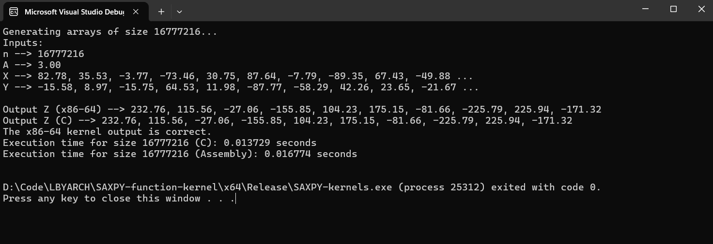

# SAXPY Function in C and x86-64 assembly language
Kernels written in C and x86-64 assembly language that performs the SAXPY (A*X + Y) function.

```Developed by Andre Aquino & Bien Miranda```

## Execution Times and Analysis
The SAXPY function goes by the formula:

```Z[i] = A * X[i] + Y[i+1]```

- Integer ```n``` that determines the size of arrays
- ```A``` is a float variable
- ```X``` & ```Y``` are input float arrays with initial data of size ```n```
- ```Z``` is the output float array of size ```n``` where all the results are stored


### Debug Mode
| Kernel         | Vector Size (n) | Average Execution Time (seconds) |
|-----------------|-----------------|----------------------------------|
| C               | 2^20            |                         0.002361 |
| C               | 2^24            |                         0.028201 |
| C               | 2^30            |                         0.426060 |
| x86-64 Assembly | 2^20            |                         0.000758 |
| x86-64 Assembly | 2^24            |                         0.015923 |
| x86-64 Assembly | 2^30            |                         0.291741 |
### Release Mode
| Kernel          | Vector Size (n) | Average Execution Time (seconds) |
|-----------------|-----------------|----------------------------------|
| C               | 2^20            |                         0.001191 |
| C               | 2^24            |                         0.011744 |
| C               | 2^30            |                         0.236500 |
| x86-64 Assembly | 2^20            |                         0.001306 |
| x86-64 Assembly | 2^24            |                         0.018940 |
| x86-64 Assembly | 2^30            |                         0.246723 |

### Analysis
<p>
The results demonstrate that the x86-64 assembly kernel consistently outperforms the C implementation, 
with the performance gap being most notable in Debug mode. This signifies the potential for substantial
speed improvements through well-crafted assembly code. Both implementations benefit significantly from 
Release mode optimizations, emphasizing their importance for performance-critical computations. Interestingly, 
the execution time of the C implementation appears to increase at a faster rate with larger vector sizes, 
particularly in Debug mode. This suggests that the assembly implementation employs careful register and memory management to minimize 
overhead.  In contrast, the C compiler might be less aggressive with optimizations in Debug mode to preserve 
debug information. While the compiler likely applies optimizations in Release mode, it may not fully match 
the carefully orchestrated efficiency possible with efficient assembly code.
</p>

## Program outputs including correctness check
### Debug Mode
#### Vector Size: 2<sup>20</sup> or 1,048,576

#### Vector Size: 2<sup>24</sup> or 16,777,216

#### Vector Size: 2<sup>28</sup> or 268,435,456


### Release Mode
#### Vector Size: 2<sup>20</sup> or 1,048,576

#### Vector Size: 2<sup>24</sup> or 16,777,216

#### Vector Size: 2<sup>28</sup> or 268,435,456
